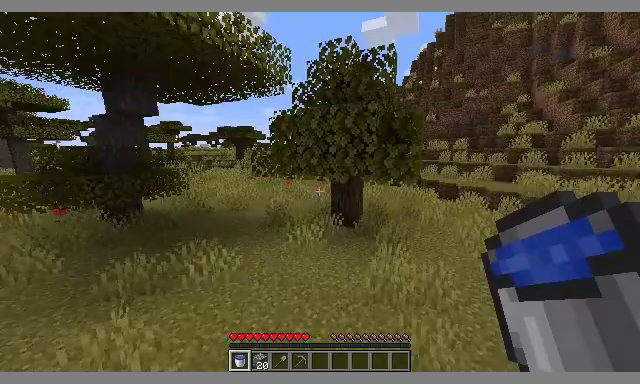
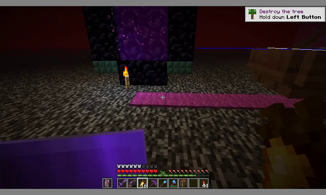
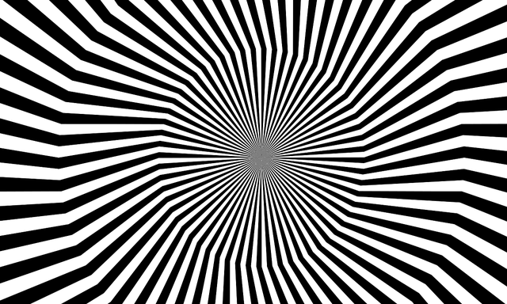

# Open Oasis 500M on GB10 — single-GPU live port (negative result)

This is my fork of [`etched-ai/open-oasis`](https://github.com/etched-ai/open-oasis), ported to run live on a single NVIDIA DGX Spark (GB10, sm_121, aarch64). It exposes the public Oasis-500M weights through a FastAPI / WebSocket server you can play in a browser the same way Etched's hosted demo works.

I'm publishing this as a **negative-result writeup**: I tried to make the public Oasis-500M weights playable on this hardware and could not. The experiment files, the modified server, and the configurations I swept are all here so anyone landing on similar hardware doesn't have to redo the matrix.

## TL;DR

**Inside ~1–2 seconds of live input, the scene crystallizes into a blurry, unresponsive frame that stops reacting to keyboard or mouse.** I exhausted the practical inference-time levers — DDIM steps, context window, camera shaping, dynamic noising, multi-frame prompting, periodic VAE re-encode, input ablation — and none of them broke the ceiling. Multiple independent groups have reported the same behavior on the public 500M weights on other hardware, so I'm treating this as the architectural ceiling of the released checkpoint, not a port bug.

For a playable Minecraft world model on the same GPU, see my other fork: [Dreamerv4-MC-GB10](https://github.com/blackfirebitcoin/Dreamerv4-MC-GB10).

## Best results I got

These are the most coherent frames I got out of my own live-play sessions. They look like real Minecraft for one or two seconds, then collapse.

| Savanna w/ water bucket | Dark portal scene |
| --- | --- |
|  |  |

Both of these are the *opening* of a session. After roughly 30–60 frames everything becomes a soft blur and stops responding to input.

## What crystallization actually looks like

The single clearest demonstration I have of the architectural ceiling is what happens when you give the model a non-Minecraft seed image. A reasonable failure mode would be the model generating a chaotic block-soup that at least drifts under input — i.e. it interprets the input as *some* kind of scene and lets the player move through it. That isn't what happens.

This is a starburst optical-illusion image, fed to the live server with normal WASD + mouse input:



The model never resolves the starburst into anything chaotic-but-Minecraft-shaped. It just locks. Even a totally out-of-distribution seed cannot knock it off its fixed point — that's the cleanest way I can describe what "crystallization" means here.

## Why I'm calling this an architectural ceiling, not a port bug

Three independent confirmations on the same public weights:

- **LoopNav (May 2025)** evaluated public Oasis-500M and reported "model collapse, where generated images progressively degrade over time… models already fail at the simplest cases."
- **WorldPack (Dec 2025)** treats Oasis as a "known-weak baseline" newer architectures beat for spatial consistency.
- **Etched's own design page** lists fuzzy distance, temporal consistency of uncertain objects, and long-context difficulties as known limitations.

The "minutes of gameplay" claims in press coverage refer to Etched's larger **unreleased** models on H100s, not the public 500M release. The downloadable checkpoint is a downscaled reference. On any hardware, what you can actually pull from HuggingFace caps out at ~1.6 seconds of memory: `dit.py` defines `max_frames=32`, and the live server defaults to a 16-frame sliding window for latency reasons. I tested both 16 and 32; the ceiling moves by a fraction of a second and that's it.

## What I tried (and what didn't help)

| Lever | Configs swept | Effect on crystallization |
| --- | --- | --- |
| DDIM steps | 1, 2, 4, 8 | None (slows FPS, ceiling unchanged) |
| Context window | 16, 32 | None (32 is the architectural max for 500M) |
| Stabilization level | 5, 15, 30 | None |
| Pin first prompt frame | on / off | None |
| Constant context-noise injection | on / off | None |
| Dynamic age-weighted noise | `max ∈ {15, 50, 100, 200}` × `age_weight ∈ {0, 0.5, 0.7}` | None |
| Camera input shaping ("safe-camera") | period=12, max=18px, pitch=0 | None — the visual feels smoother but the scene still crystallizes |
| Multi-frame video prompt | n=4, 8 | None |
| Real MineRL action prefill | n=4, 8 | None |
| Periodic VAE re-encode | period ∈ {4, 8, 12, 16} | **None — see methodological note below** |
| Input ablation | W-only, mouse-only, step-input, sparse-yaw | None |

CLI flags for every one of these are still present in `live_server.py` so the experiments are reproducible.

## Methodological note: pixel metrics lied to me

Mid-investigation I had Hu-moment / inter-frame pixel-change scoring telling me VAE re-encode at period 4 was a clear win. Visually it absolutely was not — the VAE re-encode loop adds high-frequency flicker that registers as "dynamism" in pixel-difference metrics, but the underlying scene was the same crystallized fixed point with extra noise on top. I almost shipped this as a "win" until I sat down and actually watched the output.

The lesson I'm leaving here for anyone evaluating this class of model: **for live world models, the meaningful signal is "does an experienced player feel this is responding?" — not "do consecutive frames differ in pixel space?"**

## Comparison to Dreamerv4-MC on the same GPU

I ported [Dreamerv4-MC](https://github.com/IamCreateAI/Dreamerv4-MC) to GB10 in parallel — see [Dreamerv4-MC-GB10](https://github.com/blackfirebitcoin/Dreamerv4-MC-GB10). On the same hardware, with the public released weights for both:

| Model | Live FPS | Memory window | Subjective playability |
| --- | --- | --- | --- |
| Open Oasis 500M | ~2 FPS @ ddim=4, win=16 | 16 frames live (~0.8s), 32 architectural max (~1.6s) | crystallizes within ~2s, does not recover |
| Dreamerv4-MC | ~3 FPS @ steps_size=4 | 256-frame KV cache (~85s) | several minutes of stable play, world persistence |

Both are slow on GB10 — neither is "real-time" in the way Etched's hosted demos are — so this is purely a coherence comparison. The takeaway I land on: for live single-GPU world-model serving on what's actually downloadable today, a long KV cache of cheap autoregressive frames materially outperforms a short sliding-window diffusion-forcing model, even though the diffusion-forcing model is architecturally cheaper per frame.

## What is actually in this fork

| File | Status | Notes |
| --- | --- | --- |
| `live_server.py` | new | FastAPI / WebSocket server with all experimental CLI flags from the sweep. Defaults are the baseline. |
| `utils.py` | upstream bug fix | `torchvision.io.read_video` returns THWC; upstream `load_prompt` was treating it as TCHW and silently producing a one-frame prompt. |
| `static/index.html` | new | Minimal browser UI for live play and status. |
| `dit.py`, `vae.py`, `attention.py`, `rotary_embedding_torch.py`, `generate.py` | unmodified | Carried as-is from upstream. |
| `docs/UPSTREAM-README.md` | preserved | Original Etched / Decart README. |
| `docs/results/` | new | The three images shown above. |

## Setup on GB10

Same as upstream, plus the live-server deps:

```bash
git clone https://github.com/blackfirebitcoin/Open-Oasis-500M-GB10.git
cd Open-Oasis-500M-GB10
pip install torch torchvision --index-url https://download.pytorch.org/whl/cu121
pip install einops diffusers timm av fastapi uvicorn websockets
huggingface-cli login
huggingface-cli download Etched/oasis-500m oasis500m.safetensors
huggingface-cli download Etched/oasis-500m vit-l-20.safetensors
python live_server.py --port 8766
# open http://localhost:8766
```

## What's next

Not pursuing this further on the inference side. The only realistic remaining lever I can see is training-side — LoRA finetune on long stable sequences, a custom inference stack with a DM-style memory module, or the unreleased larger Etched weights — and that's out of scope for a single-GPU port project.

If you want a playable Minecraft world model on GB10 today, use [Dreamerv4-MC-GB10](https://github.com/blackfirebitcoin/Dreamerv4-MC-GB10).

## Credits

Upstream model and reference implementation: [Etched](https://www.etched.com/) and [Decart](https://www.decart.ai/) — [`etched-ai/open-oasis`](https://github.com/etched-ai/open-oasis). This fork's GB10 port, live server scaffolding, sweep, and writeup by Page.
